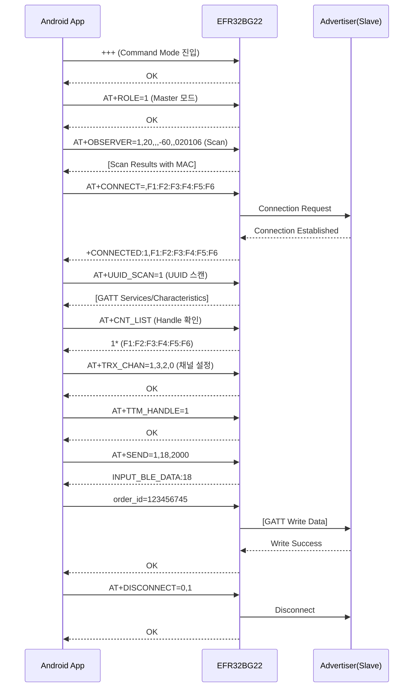

# EFR32BG22 BLE GATT 연결 및 데이터 전송 가이드

## 📋 목차
1. [개요](#개요)
2. [전체 AT Command 시퀀스](#전체-at-command-시퀀스)
3. [단계별 상세 설명](#단계별-상세-설명)
4. [Kotlin 구현 코드](#kotlin-구현-코드)
5. [주의사항](#주의사항)

---

## 개요

본 문서는 EFR32BG22 BLE 모듈을 사용하여 Android VPOS 시스템에서 Scan → Connect → GATT Data Write 과정을 구현하는 방법을 설명합니다.

### 목표
- BLE Advertiser(Slave)를 스캔하여 MAC 주소 파악
- GATT 연결 수립
- `order_id=123456745`와 같은 주문 정보 데이터 전송
- 안전한 연결 해제

### 환경
- **BLE 모듈**: EFR32BG22
- **통신 방식**: UART (/dev/ttyS1, 115200 baud)
- **개발 언어**: Kotlin (Android)
- **역할**: Master (Central) 모드

---

## 전체 AT Command 시퀀스



---

## 단계별 상세 설명

### 1단계: Command Mode 진입

**목적**: BLE 모듈을 AT Command를 받을 수 있는 상태로 전환

**AT Command**
```
+++
```

**특징**
- ⚠️ **CRLF 없이 전송** (유일한 예외)
- 다른 모든 AT Command는 `\r\n` 필수

**응답**
```
OK
```

**Kotlin 코드**
```kotlin
fun enterCommandMode() {
    outputStream?.write("+++".toByteArray())
    outputStream?.flush()
    Thread.sleep(200) // 응답 대기
}
```

---

### 2단계: Master 모드 설정

**목적**: Scan 및 Connect를 수행하기 위한 Central(Master) 역할 설정

**AT Command**
```
AT+ROLE=1\r\n
```

**파라미터**
- `0`: Slave 모드
- `1`: Master 모드
- `2`: Master-Slave 모드

**응답**
```
OK
```

**Kotlin 코드**
```kotlin
fun setMasterMode() {
    sendCommand("AT+ROLE=1")
}
```

---

### 3단계: BLE Scan 실행

**목적**: 주변 Advertiser 장치를 스캔하여 MAC 주소 및 RSSI 정보 수집

**AT Command**
```
AT+OBSERVER=1,20,,,-60,,020106\r\n
```

**파라미터**
| 순서 | 값 | 설명 |
|------|-----|------|
| 1 | 1 | Observer 기능 활성화 |
| 2 | 20 | 스캔 지속 시간 (초) |
| 3 | (빈값) | MAC 주소 필터 (없음) |
| 4 | (빈값) | 이름 필터 (없음) |
| 5 | -60 | RSSI 필터 (-60dBm 이상만) |
| 6 | (빈값) | Vendor ID 필터 (없음) |
| 7 | 020106 | Advertising Data 필터 (선택사항) |

**응답 예시**
```
+SCAN:F1:F2:F3:F4:F5:F6,-45,MyDevice
+SCAN:A1:A2:A3:A4:A5:A6,-55,TestBLE
OK
```

**Kotlin 코드**
```kotlin
fun scanDevices(timeout: Int = 20, minRssi: Int = -60): List<String> {
    val response = sendCommand("AT+OBSERVER=1,$timeout,,,$minRssi,,020106")
    return parseScanResults(response)
}
```

---

### 4단계: 대상 장치에 연결

**목적**: 스캔으로 발견한 Advertiser에게 GATT 연결 수립

**AT Command**
```
AT+CONNECT=,F1:F2:F3:F4:F5:F6\r\n
```

**파라미터**
- 첫 번째: 연결 타입 (빈값 = 일반 연결)
- 두 번째: 대상 MAC 주소

**응답**
```
OK
+CONNECTED:1,F1:F2:F3:F4:F5:F6
```

**연결 성공 시 자동 할당**
- Connection Handle: `1` (첫 번째 연결)
- 이후 모든 통신에서 이 Handle 사용

**Kotlin 코드**
```kotlin
fun connectToDevice(macAddress: String): Boolean {
    val response = sendCommand("AT+CONNECT=,$macAddress")
    Thread.sleep(2000) // 연결 대기
    return response.contains("CONNECTED")
}
```

---

### 5단계: UUID Scan 활성화 (핵심!)

**목적**: 연결된 Slave의 GATT Service 및 Characteristic UUID 자동 스캔

**AT Command**
```
AT+UUID_SCAN=1\r\n
```

**응답 예시**
```
OK
-CHAR:0 UUID:002A,Read;
-CHAR:1 UUID:052A,Indicate;
-CHAR:2 UUID:E4FF,Notify;
-CHAR:3 UUID:E9FF,Write Without Response,Write;
-CHAR:4 UUID:F3FF,Read,Notify;
-CHAR:5 UUID:91FF,Read,Write Without Response,Write;
```

**출력 정보**
- **CHAR:X**: 채널 번호 (이후 AT+TRX_CHAN에서 사용)
- **UUID**: Characteristic UUID
- **속성**: Read, Write, Notify, Indicate 등

**중요성**
> 이 단계 없이는 어떤 Characteristic에 데이터를 써야 할지 알 수 없습니다!

**Kotlin 코드**
```kotlin
data class Characteristic(
    val channelNumber: Int,
    val uuid: String,
    val properties: List<String>
)

fun scanUUIDs(): List<Characteristic> {
    val response = sendCommand("AT+UUID_SCAN=1")
    return parseCharacteristics(response)
}
```

---

### 6단계: Connection Handle 확인

**목적**: 현재 연결된 장치의 Handle 번호 확인 (멀티 커넥션 지원)

**AT Command**
```
AT+CNT_LIST\r\n
```

**응답 예시**
```
AT+CNT_LIST=
1* (F1:F2:F3:F4:F5:F6)
2  (A1:A2:A3:A4:A5:A6)
OK
```

**응답 해석**
- `1*`: Handle 1번 (★는 현재 Master 역할로 연결됨)
- `2`: Handle 2번 (Master 역할)
- 괄호 안: 연결된 장치의 MAC 주소

**Kotlin 코드**
```kotlin
fun getConnectionList(): Map<Int, String> {
    val response = sendCommand("AT+CNT_LIST")
    return parseConnectionList(response)
    // 예: {1 to "F1:F2:F3:F4:F5:F6", 2 to "A1:A2:A3:A4:A5:A6"}
}
```

---

### 7단계: 송수신 채널 설정

**목적**: GATT Write/Notify Characteristic 지정

**AT Command**
```
AT+TRX_CHAN=1,3,2,0\r\n
```

**파라미터**
| 순서 | 값 | 설명 |
|------|-----|------|
| 1 | 1 | Connection Handle (AT+CNT_LIST에서 확인) |
| 2 | 3 | Write 채널 번호 (UUID_SCAN 결과의 CHAR:3) |
| 3 | 2 | Notify 채널 번호 (UUID_SCAN 결과의 CHAR:2) |
| 4 | 0 | Write 속성 선택 (0=Without Response, 1=With Response) |

**응답**
```
OK
```

**채널 선택 가이드**
- **Write 채널**: `Write` 또는 `Write Without Response` 속성 필수
- **Notify 채널**: `Notify` 또는 `Indicate` 속성 필수

**Kotlin 코드**
```kotlin
fun setTransmissionChannels(
    handle: Int,
    writeChannel: Int,
    notifyChannel: Int,
    writeType: Int = 0 // 0=Without Response, 1=With Response
) {
    sendCommand("AT+TRX_CHAN=$handle,$writeChannel,$notifyChannel,$writeType")
}
```

---

### 8단계: Transparent Transmission Handle 지정

**목적**: 멀티 커넥션 환경에서 데이터 전송 대상 지정

**AT Command**
```
AT+TTM_HANDLE=1\r\n
```

**파라미터**
- `1`: 데이터를 전송할 Connection Handle

**응답**
```
OK
```

**특징**
- 멀티 커넥션 시 필수
- 단일 연결에서도 설정 권장
- 전원 꺼지면 초기화 (저장 안 됨)

**Kotlin 코드**
```kotlin
fun setTransmissionHandle(handle: Int) {
    sendCommand("AT+TTM_HANDLE=$handle")
}
```

---

### 9단계: 데이터 전송 (상세)

**목적**: GATT Characteristic에 주문 정보 등 업무 데이터 전송

#### 📌 방법 1: AT+SEND 명령 사용 (권장)

**동작 과정**
```
[Step 1] AT+SEND 명령 전송 → 모듈이 데이터 입력 대기 상태로 전환
[Step 2] 실제 데이터 전송 → 모듈이 BLE를 통해 Slave에 Write
```

**AT Command**
```
AT+SEND=1,18,2000\r\n
```

**파라미터**
| 순서 | 값 | 설명 |
|------|-----|------|
| 1 | 1 | Connection Handle |
| 2 | 18 | 전송할 데이터 길이 (바이트) |
| 3 | 2000 | 타임아웃 (2000ms = 2초) |

**응답**
```
OK
INPUT_BLE_DATA:18
```

이 응답이 나오면 **데이터 입력 대기 상태**입니다.

**실제 데이터 전송**
```
order_id=123456745
```
⚠️ **CRLF 없이 순수 데이터만 전송**

**전송 완료 응답**
```
OK
```

**Kotlin 구현**
```kotlin
fun sendDataWithATSend(handle: Int, data: String, timeoutMs: Int = 2000): Boolean {
    try {
        val dataBytes = data.toByteArray()
        val dataLength = dataBytes.size
        
        // Step 1: AT+SEND 명령 전송
        val sendCommand = "AT+SEND=$handle,$dataLength,$timeoutMs"
        println("📤 Sending command: $sendCommand")
        val response1 = sendCommand(sendCommand)
        println("📥 Response: $response1")
        
        // Step 2: "INPUT_BLE_DATA:" 응답 확인
        if (response1.contains("INPUT_BLE_DATA:$dataLength")) {
            println("⏳ Module is ready to receive data...")
            
            // Step 3: 실제 데이터 전송 (CRLF 없이!)
            outputStream?.write(dataBytes)
            outputStream?.flush()
            println("✅ Data sent: $data (${dataBytes.size} bytes)")
            
            // Step 4: 전송 완료 응답 확인
            Thread.sleep(300)
            val response2 = readResponse()
            println("📥 Send result: $response2")
            
            return response2.contains("OK")
        } else {
            println("❌ ERROR: Module not ready for data input")
            return false
        }
        
    } catch (e: Exception) {
        e.printStackTrace()
        return false
    }
}
```

**사용 예시**
```kotlin
val success = sendDataWithATSend(
    handle = 1,
    data = "order_id=123456745",
    timeoutMs = 2000
)
```

---

#### 📌 방법 2: Transparent Mode 직접 전송

**동작 과정**
AT+TTM_HANDLE 설정 후 바로 데이터만 전송 (AT Command 없이)

**데이터 전송**
```
order_id=123456745
```
(그냥 바로 전송)

**Kotlin 구현**
```kotlin
fun sendDataTransparent(data: String): Boolean {
    try {
        // Transparent Mode에서는 데이터만 전송
        val dataBytes = data.toByteArray()
        outputStream?.write(dataBytes)
        outputStream?.flush()
        println("✅ Data sent (Transparent): $data")
        
        // 응답 확인 (선택사항)
        Thread.sleep(300)
        val response = readResponse()
        println("📥 Response: $response")
        
        return true
    } catch (e: Exception) {
        e.printStackTrace()
        return false
    }
}
```

**사용 예시**
```kotlin
// 1. AT+TTM_HANDLE 설정 (한 번만)
sendCommand("AT+TTM_HANDLE=1")

// 2. 이후 데이터만 계속 전송 가능
sendDataTransparent("order_id=123456745")
sendDataTransparent("order_id=987654321")
```

---

#### 🔍 방법 1 vs 방법 2 비교

| 구분 | 방법 1: AT+SEND | 방법 2: Transparent Mode |
|------|------------------|---------------------------|
| **명령 형식** | `AT+SEND=1,18,2000` + 데이터 | 데이터만 전송 |
| **데이터 길이** | 사전 지정 필수 | 자유 (버퍼 크기까지) |
| **타임아웃** | 설정 가능 | 없음 |
| **응답 확인** | 명확한 OK 응답 | 응답 불명확 |
| **에러 처리** | 길이 불일치/타임아웃 감지 | 에러 감지 어려움 |
| **사용 복잡도** | ⭐⭐⭐ (2단계 필요) | ⭐ (간단) |
| **안정성** | ⭐⭐⭐⭐⭐ (높음) | ⭐⭐⭐ (보통) |
| **디버깅** | ⭐⭐⭐⭐⭐ (쉬움) | ⭐⭐ (어려움) |
| **멀티 전송** | 매번 AT+SEND 필요 | 연속 전송 가능 |
| **AT Mode** | Command Mode 유지 | Command Mode 종료됨 |
| **권장 상황** | 단발성 중요 데이터 전송 | 연속적인 스트리밍 데이터 |
| **추천도** | ⭐⭐⭐⭐⭐ | ⭐⭐⭐ |

---

#### 💡 방법 선택 가이드

**방법 1 (AT+SEND)을 선택하세요:**
- ✅ 결제/주문 등 중요한 데이터 전송
- ✅ 전송 성공 여부를 명확히 확인해야 할 때
- ✅ 데이터 무결성이 중요할 때
- ✅ 디버깅이 필요한 개발 단계

**방법 2 (Transparent)를 선택하세요:**
- ✅ 센서 데이터 등 연속 스트리밍
- ✅ 전송 속도가 중요할 때
- ✅ 간단한 테스트 목적
- ✅ 실시간성이 중요할 때

---

#### ⚠️ 데이터 전송 주의사항

1. **데이터 길이 정확성 (방법 1)**
   ```kotlin
   val data = "order_id=123456745"
   val length = data.toByteArray().size // 18바이트
   // AT+SEND의 length 파라미터와 정확히 일치해야 함
   ```

2. **CRLF 주의**
   - AT+SEND 명령: `\r\n` 필요 ✅
   - 실제 데이터: `\r\n` 불필요 ❌

3. **타임아웃 설정**
   ```kotlin
   // 충분한 타임아웃 설정 (최소 1000ms)
   sendDataWithATSend(1, data, timeoutMs = 2000)
   ```

4. **버퍼 크기 제한**
   - 최대 전송 크기: 3328 바이트
   - 권장 패킷 크기: 20~247 바이트

5. **응답 대기**
   ```kotlin
   // 각 단계마다 충분한 대기 시간 필요
   Thread.sleep(300) // 최소 100ms 이상
   ```

---

### 10단계: 연결 해제

**목적**: GATT 연결을 안전하게 종료하고 리소스 해제

**AT Command**
```
AT+DISCONNECT=0,1\r\n
```

**파라미터**
| 순서 | 값 | 설명 |
|------|-----|------|
| 1 | 0 | 역할 선택 (0=Slave 연결 해제, 1=Master 연결 해제, 2=Both) |
| 2 | 1 | 해제할 Connection Handle |

**역할 선택 상세**
- `0`: Master 입장에서 연결된 Slave 해제
- `1`: Slave 입장에서 연결된 Master 해제
- `2`: Master-Slave 양방향 연결 해제

**응답**
```
OK
+DISCONNECTED:1
```

**Kotlin 코드**
```kotlin
fun disconnectDevice(handle: Int) {
    sendCommand("AT+DISCONNECT=0,$handle")
    Thread.sleep(500) // 연결 해제 대기
}
```

---

## Kotlin 구현 코드

### 완전한 BLE Master Controller 클래스

```kotlin
import java.io.File
import java.io.FileInputStream
import java.io.FileOutputStream

/**
 * EFR32BG22 BLE Master Controller
 * GATT 연결 및 데이터 전송 통합 관리
 */
class BLEMasterController {
    companion object {
        private const val SERIAL_PORT = "/dev/ttyS1"
        private const val BAUD_RATE = 115200
    }
    
    private var inputStream: FileInputStream? = null
    private var outputStream: FileOutputStream? = null
    
    // Serial Port 열기
    fun openSerialPort(): Boolean {
        return try {
            val file = File(SERIAL_PORT)
            inputStream = FileInputStream(file)
            outputStream = FileOutputStream(file)
            println("✅ Serial port opened: $SERIAL_PORT")
            true
        } catch (e: Exception) {
            println("❌ Failed to open serial port: ${e.message}")
            e.printStackTrace()
            false
        }
    }
    
    // Serial Port 닫기
    fun closeSerialPort() {
        inputStream?.close()
        outputStream?.close()
        println("🔒 Serial port closed")
    }
    
    // AT Command 전송 (CRLF 포함)
    private fun sendCommand(command: String): String {
        return try {
            val commandWithCRLF = command + "\r\n"
            outputStream?.write(commandWithCRLF.toByteArray())
            outputStream?.flush()
            
            Thread.sleep(500) // 응답 대기
            readResponse()
        } catch (e: Exception) {
            e.printStackTrace()
            ""
        }
    }
    
    // +++ 전송 (CRLF 없이)
    private fun enterCommandMode() {
        try {
            outputStream?.write("+++".toByteArray())
            outputStream?.flush()
            Thread.sleep(200)
        } catch (e: Exception) {
            e.printStackTrace()
        }
    }
    
    // 응답 읽기
    private fun readResponse(): String {
        return try {
            val buffer = ByteArray(2048)
            val available = inputStream?.available() ?: 0
            if (available > 0) {
                val bytesRead = inputStream?.read(buffer, 0, available) ?: 0
                String(buffer, 0, bytesRead)
            } else {
                ""
            }
        } catch (e: Exception) {
            e.printStackTrace()
            ""
        }
    }
    
    // Scan 결과 파싱
    private fun parseScanResults(response: String): List<BLEDevice> {
        val devices = mutableListOf<BLEDevice>()
        val lines = response.split("\n")
        
        for (line in lines) {
            if (line.startsWith("+SCAN:")) {
                // +SCAN:F1:F2:F3:F4:F5:F6,-45,MyDevice
                val parts = line.substring(6).split(",")
                if (parts.size >= 2) {
                    devices.add(
                        BLEDevice(
                            mac = parts[0].trim(),
                            rssi = parts[1].trim().toIntOrNull() ?: 0,
                            name = parts.getOrNull(2)?.trim() ?: "Unknown"
                        )
                    )
                }
            }
        }
        return devices
    }
    
    // Characteristic 파싱
    private fun parseCharacteristics(response: String): List<Characteristic> {
        val chars = mutableListOf<Characteristic>()
        val lines = response.split("\n")
        
        for (line in lines) {
            if (line.contains("-CHAR:")) {
                // -CHAR:3 UUID:E9FF,Write Without Response,Write;
                val match = Regex("-CHAR:(\\d+) UUID:([0-9A-F]+),(.+)").find(line)
                if (match != null) {
                    val (channel, uuid, props) = match.destructured
                    chars.add(
                        Characteristic(
                            channelNumber = channel.toInt(),
                            uuid = uuid,
                            properties = props.split(",").map { it.trim().trimEnd(';') }
                        )
                    )
                }
            }
        }
        return chars
    }
    
    /**
     * 전체 연결 및 데이터 전송 프로세스
     * @param macAddress 대상 BLE 장치 MAC 주소
     * @param orderData 전송할 주문 데이터
     * @return 성공 여부
     */
    fun connectAndSendData(macAddress: String, orderData: String): Boolean {
        try {
            println("🚀 Starting BLE connection process...")
            
            // Step 1: Command Mode 진입
            println("\n[Step 1] Entering Command Mode...")
            enterCommandMode()
            Thread.sleep(200)
            
            // Step 2: Master 모드 설정
            println("\n[Step 2] Setting Master mode...")
            val roleResponse = sendCommand("AT+ROLE=1")
            if (!roleResponse.contains("OK")) {
                println("❌ Failed to set Master mode")
                return false
            }
            
            // Step 3: UUID Scan 활성화
            println("\n[Step 3] Enabling UUID scan...")
            sendCommand("AT+UUID_SCAN=1")
            
            // Step 4: Connect
            println("\n[Step 4] Connecting to $macAddress...")
            val connectResponse = sendCommand("AT+CONNECT=,$macAddress")
            println("Response: $connectResponse")
            Thread.sleep(2000) // 연결 대기
            
            // Step 5: Connection Handle 확인
            println("\n[Step 5] Checking connection list...")
            val cntList = sendCommand("AT+CNT_LIST")
            println("Connected devices: $cntList")
            
            if (!cntList.contains(macAddress)) {
                println("❌ Connection failed")
                return false
            }
            
            // Step 6: UUID 스캔 결과 확인
            println("\n[Step 6] Waiting for UUID scan results...")
            Thread.sleep(1000)
            val uuidResponse = readResponse()
            println("UUID scan results:\n$uuidResponse")
            
            val characteristics = parseCharacteristics(uuidResponse)
            println("Parsed ${characteristics.size} characteristics")
            
            // Write 채널 찾기 (Write 속성 포함)
            val writeChar = characteristics.find { 
                it.properties.any { prop -> prop.contains("Write") }
            }
            
            // Notify 채널 찾기
            val notifyChar = characteristics.find { 
                it.properties.any { prop -> prop.contains("Notify") }
            }
            
            if (writeChar == null || notifyChar == null) {
                println("❌ Required characteristics not found")
                return false
            }
            
            println("📝 Write channel: ${writeChar.channelNumber} (UUID: ${writeChar.uuid})")
            println("📢 Notify channel: ${notifyChar.channelNumber} (UUID: ${notifyChar.uuid})")
            
            // Step 7: TRX Channel 설정
            println("\n[Step 7] Setting transmission channels...")
            val writeType = if (writeChar.properties.contains("Write Without Response")) 0 else 1
            sendCommand("AT+TRX_CHAN=1,${writeChar.channelNumber},${notifyChar.channelNumber},$writeType")
            
            // Step 8: TTM Handle 설정
            println("\n[Step 8] Setting transmission handle...")
            sendCommand("AT+TTM_HANDLE=1")
            
            // Step 9: 데이터 전송
            println("\n[Step 9] Sending data: $orderData")
            val sendSuccess = sendDataWithATSend(1, orderData, 2000)
            
            if (!sendSuccess) {
                println("❌ Data transmission failed")
                return false
            }
            
            // Step 10: Disconnect
            println("\n[Step 10] Disconnecting...")
            Thread.sleep(500)
            sendCommand("AT+DISCONNECT=0,1")
            
            println("\n✅ Process completed successfully!")
            return true
            
        } catch (e: Exception) {
            println("❌ Error occurred: ${e.message}")
            e.printStackTrace()
            return false
        }
    }
    
    /**
     * AT+SEND를 사용한 데이터 전송
     */
    private fun sendDataWithATSend(handle: Int, data: String, timeoutMs: Int): Boolean {
        try {
            val dataBytes = data.toByteArray()
            val dataLength = dataBytes.size
            
            // AT+SEND 명령 전송
            val sendCommand = "AT+SEND=$handle,$dataLength,$timeoutMs"
            println("📤 Command: $sendCommand")
            val response1 = sendCommand(sendCommand)
            println("📥 Response: $response1")
            
            // INPUT_BLE_DATA 확인
            if (response1.contains("INPUT_BLE_DATA:$dataLength")) {
                println("⏳ Module ready, sending data...")
                
                // 실제 데이터 전송
                outputStream?.write(dataBytes)
                outputStream?.flush()
                println("✅ Data sent: $data (${dataBytes.size} bytes)")
                
                // 전송 완료 확인
                Thread.sleep(300)
                val response2 = readResponse()
                println("📥 Result: $response2")
                
                return response2.contains("OK")
            } else {
                println("❌ Module not ready for data")
                return false
            }
            
        } catch (e: Exception) {
            e.printStackTrace()
            return false
        }
    }
    
    /**
     * 간단한 스캔 기능
     */
    fun scanDevices(timeout: Int = 20, minRssi: Int = -60): List<BLEDevice> {
        enterCommandMode()
        Thread.sleep(200)
        
        println("🔍 Scanning for devices...")
        val response = sendCommand("AT+OBSERVER=1,$timeout,,,$minRssi,,020106")
        
        val devices = parseScanResults(response)
        println("📱 Found ${devices.size} devices")
        
        return devices
    }
}

// 데이터 클래스
data class BLEDevice(
    val mac: String,
    val rssi: Int,
    val name: String
)

data class Characteristic(
    val channelNumber: Int,
    val uuid: String,
    val properties: List<String>
)
```

---

### 사용 예제

#### 예제 1: 기본 사용

```kotlin
fun main() {
    val controller = BLEMasterController()
    
    // 1. Serial Port 열기
    if (!controller.openSerialPort()) {
        println("Failed to open serial port")
        return
    }
    
    // 2. 전체 프로세스 실행
    val success = controller.connectAndSendData(
        macAddress = "F1:F2:F3:F4:F5:F6",
        orderData = "order_id=123456745"
    )
    
    // 3. Serial Port 닫기
    controller.closeSerialPort()
    
    // 4. 결과 확인
    if (success) {
        println("✅ SUCCESS: Data sent successfully!")
    } else {
        println("❌ FAILED: Data transmission failed!")
    }
}
```

#### 예제 2: Scan 후 연결

```kotlin
fun scanAndConnect() {
    val controller = BLEMasterController()
    controller.openSerialPort()
    
    // 1. 주변 장치 스캔
    val devices = controller.scanDevices(timeout = 10, minRssi = -70)
    
    // 2. 장치 목록 출력
    println("\n📱 Available devices:")
    devices.forEachIndexed { index, device ->
        println("[$index] ${device.name} (${device.mac}) - RSSI: ${device.rssi}dBm")
    }
    
    // 3. 첫 번째 장치에 연결
    if (devices.isNotEmpty()) {
        val targetDevice = devices[0]
        println("\n🎯 Connecting to: ${targetDevice.name}")
        
        val success = controller.connectAndSendData(
            macAddress = targetDevice.mac,
            orderData = "order_id=123456745"
        )
        
        println(if (success) "✅ Success" else "❌ Failed")
    }
    
    controller.closeSerialPort()
}
```

#### 예제 3: Android Activity 통합

```kotlin
class BLEActivity : AppCompatActivity() {
    private lateinit var bleController: BLEMasterController
    
    override fun onCreate(savedInstanceState: Bundle?) {
        super.onCreate(savedInstanceState)
        setContentView(R.layout.activity_ble)
        
        bleController = BLEMasterController()
        
        // 버튼 클릭 이벤트
        findViewById<Button>(R.id.btnConnect).setOnClickListener {
            sendOrderData()
        }
    }
    
    private fun sendOrderData() {
        // 백그라운드 스레드에서 실행
        Thread {
            try {
                bleController.openSerialPort()
                
                val orderId = "order_id=123456745"
                val macAddress = "F1:F2:F3:F4:F5:F6"
                
                val success = bleController.connectAndSendData(macAddress, orderId)
                
                // UI 스레드에서 결과 표시
                runOnUiThread {
                    if (success) {
                        Toast.makeText(this, "주문 전송 성공", Toast.LENGTH_SHORT).show()
                    } else {
                        Toast.makeText(this, "주문 전송 실패", Toast.LENGTH_SHORT).show()
                    }
                }
                
                bleController.closeSerialPort()
                
            } catch (e: Exception) {
                e.printStackTrace()
                runOnUiThread {
                    Toast.makeText(this, "에러 발생: ${e.message}", Toast.LENGTH_LONG).show()
                }
            }
        }.start()
    }
    
    override fun onDestroy() {
        super.onDestroy()
        bleController.closeSerialPort()
    }
}
```

---

## 주의사항

### ⚠️ Serial Port 통신

1. **CRLF (Carriage Return + Line Feed)**
   - `+++` 명령: CRLF 없이 전송
   - 모든 AT 명령: `\r\n` 필수
   - 데이터 전송: CRLF 없이

2. **Baud Rate**
   - 기본값: 115200
   - 설정: 8 data bits, 1 stop bit, no parity

3. **버퍼 크기**
   - 최대 수신 버퍼: 3328 바이트
   - 권장 패킷 크기: 20~247 바이트

### ⚠️ 연결 관리

1. **타임아웃 설정**
   - Connect: 최소 2초
   - Scan: 상황에 맞게 10~30초
   - Data send: 최소 1초

2. **에러 처리**
   ```kotlin
   // 항상 try-catch로 감싸기
   try {
       controller.connectAndSendData(mac, data)
   } catch (e: Exception) {
       Log.e("BLE", "Error: ${e.message}")
   } finally {
       controller.closeSerialPort()
   }
   ```

3. **리소스 관리**
   - 사용 후 반드시 `closeSerialPort()` 호출
   - 멀티 스레드 환경에서는 동기화 필요

### ⚠️ BLE 프로토콜

1. **Service UUID 확인**
   - 기본 Service UUID: `6E400001-B5A3-F393-E0A9-E50E24DCCA9E`
   - RX (Write): `6E400002-...`
   - TX (Notify): `6E400003-...`

2. **Characteristic 속성**
   - Write 채널: `Write` 또는 `Write Without Response`
   - Notify 채널: `Notify` 또는 `Indicate`

3. **연결 수 제한**
   - 최대 8개 동시 연결 가능
   - Handle 범위: 1~8

### ⚠️ 데이터 전송

1. **데이터 길이 검증**
   ```kotlin
   val data = "order_id=123456745"
   val length = data.toByteArray().size
   // AT+SEND의 length와 반드시 일치
   ```

2. **특수 문자 처리**
   - `\r\n`은 2바이트로 계산
   - UTF-8 인코딩 고려

3. **전송 확인**
   - 항상 응답 확인
   - 실패 시 재시도 로직 구현

---

## 문제 해결

### 🔧 자주 발생하는 문제

#### 문제 1: Connection 실패
**증상**: `AT+CONNECT` 후 `+CONNECTED` 응답 없음

**원인**:
- Advertiser가 연결 가능 상태가 아님
- MAC 주소 오류
- 신호 강도 약함 (RSSI < -80dBm)

**해결**:
1. Advertiser 상태 확인
2. Scan으로 MAC 주소 재확인
3. 거리 가까이 이동

#### 문제 2: UUID_SCAN 결과 없음
**증상**: `AT+UUID_SCAN=1` 후 Characteristic 정보 출력 안 됨

**원인**:
- 연결이 완료되지 않음
- Slave에 GATT Service 없음

**해결**:
1. 연결 후 충분한 대기 시간 (2초)
2. `AT+CNT_LIST`로 연결 확인
3. Slave의 GATT Service 설정 확인

#### 문제 3: 데이터 전송 실패
**증상**: `AT+SEND` 후 `RECEIVE_TIMEOUT` 에러

**원인**:
- 데이터 길이 불일치
- 타임아웃 시간 부족
- Write Characteristic 없음

**해결**:
1. 데이터 길이 정확히 계산
   ```kotlin
   val length = data.toByteArray().size
   ```
2. 타임아웃 증가 (2000ms 이상)
3. TRX_CHAN 설정 재확인

#### 문제 4: Serial Port 접근 권한 오류
**증상**: `/dev/ttyS1` 열기 실패

**원인**:
- SELinux 권한 문제
- 파일 권한 문제

**해결**:
```bash
# Root 권한으로
chmod 666 /dev/ttyS1
# 또는
setenforce 0
```

---

## 참고 자료

### 📚 문서
- EFR32BG22 Master-Slave Module and Protocol V1.7
- Android Serial Port API Documentation
- BLE GATT Specification

### 🔗 관련 링크
- [EFR32BG22 제조사 사이트](http://www.szrfstar.com)
- Android BLE Guide: [developer.android.com/guide/topics/connectivity/bluetooth-le](https://developer.android.com/guide/topics/connectivity/bluetooth-le)

### 📝 버전 정보
- **문서 버전**: 1.0
- **작성일**: 2024-12-04
- **BLE 모듈**: EFR32BG22
- **펌웨어 버전**: V1.7
- **프로토콜**: 115200 baud, 8N1

---

## 부록

### A. AT Command 전체 목록

| Command | 기능 | 파라미터 |
|---------|------|----------|
| `+++` | Command Mode 진입 | 없음 (CRLF X) |
| `AT+ROLE=1` | Master 모드 설정 | 0=Slave, 1=Master, 2=Both |
| `AT+OBSERVER=1,20,,,-60` | Scan 실행 | 활성화,시간,필터들... |
| `AT+CONNECT=,MAC` | 연결 | MAC 주소 |
| `AT+UUID_SCAN=1` | UUID 스캔 활성화 | 0=비활성, 1=활성 |
| `AT+CNT_LIST` | 연결 목록 조회 | 없음 |
| `AT+TRX_CHAN=1,3,2,0` | 송수신 채널 설정 | Handle,Write,Notify,Type |
| `AT+TTM_HANDLE=1` | 전송 Handle 지정 | Handle 번호 |
| `AT+SEND=1,18,2000` | 데이터 전송 | Handle,길이,타임아웃 |
| `AT+DISCONNECT=0,1` | 연결 해제 | 역할,Handle |

### B. 에러 코드

| 에러 | 의미 | 해결 방법 |
|------|------|-----------|
| `RECEIVE_TIMEOUT` | 데이터 입력 시간 초과 | 타임아웃 증가 |
| `ERROR` | 일반 에러 | 명령 형식 확인 |
| `-2500` | SDK 함수 에러 | AT Command 직접 사용 |
| 연결 실패 | 대상 장치 없음 | Scan으로 재확인 |

### C. 용어 정리

| 용어 | 설명 |
|------|------|
| **Master** | Central, Scanner 역할 (Android 앱) |
| **Slave** | Peripheral, Advertiser 역할 (BLE 기기) |
| **GATT** | Generic Attribute Profile (BLE 데이터 프로토콜) |
| **Characteristic** | GATT의 데이터 단위 (읽기/쓰기/알림) |
| **Handle** | 연결된 장치를 식별하는 번호 (1~8) |
| **UUID** | Universally Unique Identifier (Service/Characteristic 식별) |
| **RSSI** | Received Signal Strength Indicator (신호 강도) |
| **Transparent Mode** | AT Command 없이 데이터만 전송하는 모드 |

---

**문서 끝**
